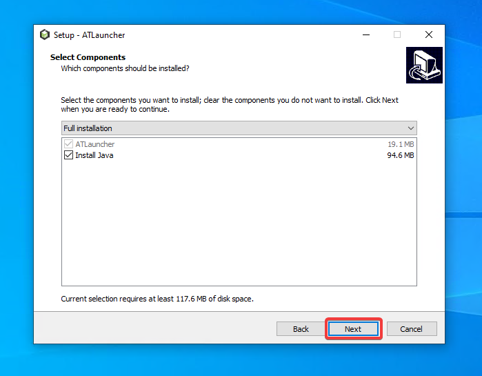

You can always find the latest up to date links to download the latest version of ATLauncher from the
[downloads page](https://atlauncher.com/downloads).

## Windows

ATLauncher is super simple to install on Windows. We provide a simple and easy to use installer that you can get setup
and running within minutes. If you haven't already, download the Windows Setup from the downloads page, then simply
double click it to run the setup process.

You may get issues with downloading through Edge, or when trying to open the installer, saying it could harm your device
or is unsafe. All our code is completely [open source](https://atl.pw/github), so you can verify every bit of code we
run on your computer.

Click here if downloading through Edge and seeing a warning about it harming your device.

If you downloaded it through the Edge browser, you may get warned that it was blocked from downloading and could harm
your device. ATLauncher is safe, and Edge/Windows can be overly protective. In order to bypass this, simply click the
"..." and choose Keep.

Then click "Show more" and then "Keep anyway". This will let the download complete.

Click here if Windows Smart Screen is blocking the installer.

If you do see a warning, you can click "More info" and then "Run anyway". This will allow you to continue with the
installer:

Once the setup has run, you can click Next on the first screen:

Then you can read the License Agreement, and if you accept, click the "I accept the agreement" checkbox and then hit
"Next":

On the next screen you can choose if you want to install Java or not. ATLauncher requires Java on your computer in order
to run itself and Minecraft. By checking this box it will install a version of Java that works with the launcher and for
Minecraft. If you already have Java installed on your computer, you can uncheck this box, but it's best to leave it
checked:

Next you can choose if you want to create a desktop shortcut to ATLauncher so you can access it from an icon on your
desktop. If you don't want that, just uncheck it, then click "Next":

Finally you'll get a summary of what will be installed. You can go back, or to proceed, click "Install":

The install process will download files it needs, then once done it will show you the final screen, allowing you to
launch ATLauncher right away and then finish and close the installer:

That's it. Now you're done installing ATLauncher, you can play from the desktop icon or from your start menu at any
time.

## Linux

We provide multiple different packaged versions of the launcher for Linux, so you can choose the one that is best for
you.

Flatpak is the recommended way to install ATLauncher on Linux and is available on many different Linux distributions
through the built in store or package manager through integrations that allow Flathub packages to be installed.

For more information, including install instructions for your Linux distribution, see the ATLauncher page on
[Flathub](https://flathub.org/apps/com.atlauncher.ATLauncher).

### AUR (Arch Linux)

We also provide 2 packages for Arch Linux, available through the AUR.
[atlauncher](https://aur.archlinux.org/packages/atlauncher/) and
[atlauncher-bin](https://aur.archlinux.org/packages/atlauncher-bin/).

`atlauncher` will compile the launcher from source, while `atlauncher-bin` will download the latest release from the
[releases page](https://github.com/ATLauncher/ATLauncher/releases) on GitHub.

### Other distributions

For other distributions, we provide a deb and rpm file for download on our downloads page to install the launcher.

## MacOS

To use this, simply download the application zip file, and then extract it to your Applications folder.

## Jar (Multiplatform)

You can download the jar version of the launcher if you want to run directly with Java.

You generally should not use this version of the launcher unless you're having issues with the other versions.