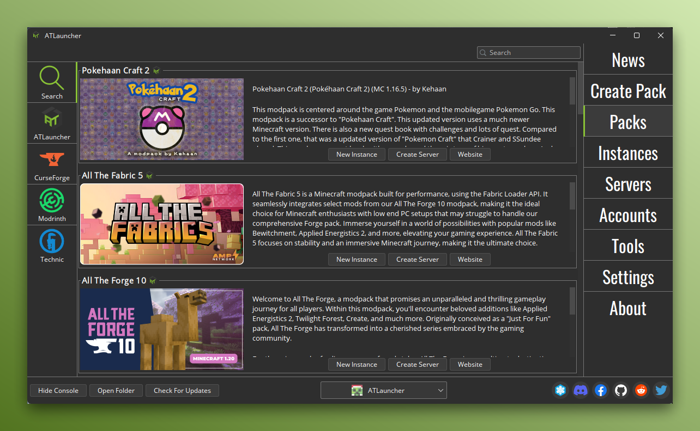

import { LinkCard, CardGrid } from '@astrojs/starlight/components';

<LinkCard
    title="Get Started Using ATLauncher"
    description="Learn how to download, install and use ATLauncher."
    href="/getting-started/"
/>

<LinkCard
    title="Guides For Using ATLauncher"
    description="Various guides for using ATLauncher and its features."
    href="/guides/"
/>

<CardGrid>
    <LinkCard title="API Docs" href="/api-docs/" description="Documentation for accessing the ATLauncher API." />
    <LinkCard title="Platform Docs (Pack Admin)" href="/pack-admin/" description="Documentation for pack admins on the ATLauncher platform." />
</CardGrid>